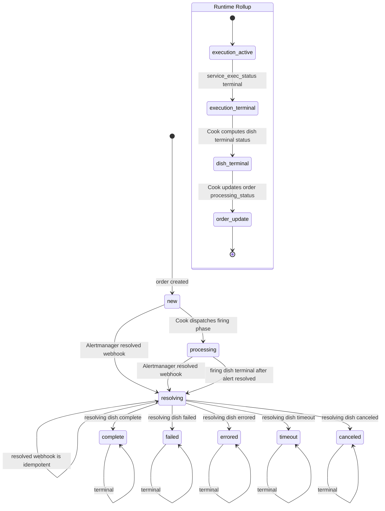

# PoundCake Architecture

## Summary

PoundCake 2.0 is a FastAPI control plane for monitoring-driven remediation and communication workflows. The API accepts alert and control-plane input, stores orders in MariaDB, and routes all provider execution through service plugins.

The core architecture is intentionally singular: every executable unit of work becomes an `order`. Alertmanager alerts, plugin health checks, and scheduled plugin service executions all enter the same order pipeline.

Production deployment is Helm based; see [OPERATOR.md](OPERATOR.md). Auth and internal RBAC behavior is covered in [AUTH_RBAC.md](AUTH_RBAC.md).

## Control Plane Actors

- **API**: Owns intake, CRUD, service registry, Cook, Expediter, timeline, health, and runtime state APIs.
- **Prep Chef**: Claims dispatchable orders and calls Cook.
- **Cook**: Creates phase dishes, seeds runtime rows through the core dish planner, dispatches ready work through Expediter, and finalizes dishes and orders.
- **Expediter**: Sole runtime gateway from PoundCake to plugin adapters.
- **Timer**: Claims in-flight runtime rows, observes provider state only through Expediter, reconciles outcomes, and asks Cook to advance.
- **Dishwasher**: Syncs plugin manifests, ingredient templates, recipes, and scheduled tasks; injects due scheduled work as orders.
- **Service Plugins**: Logical integration boundaries for external or internal systems. Their plugin adapters translate canonical PoundCake execution requests into provider-native operations.

## Core Data Model

- `orders`: Singular unit of control-plane work. Tracks alert state, processing state, remediation outcome, activity, and timing.
- `recipes`: Workflow templates selected by alert group or plugin-owned scheduled work.
- `ingredients`: Immutable plugin-provided capability templates.
- `recipe_ingredients`: Mutable recipe steps that use ingredients with overrides and phase/run-condition policy.
- `dishes`: Per-order execution instances for `firing` or `resolving` phases.
- `dish_ingredients`: Runtime execution rows with service execution ids, statuses, outcomes, errors, and timings.
- `scheduled_tasks`: Durable recurring work definitions that are injected as orders when due.
- `service_plugins`: Registered plugin metadata, health, credential, and capability state.

## Singular Order Workflow

1. Intake creates or updates an `order`.
2. Prep Chef claims dispatchable orders and calls `POST /api/v1/cook/orders/{order_id}`.
3. Cook chooses the run phase:
   - `new` orders dispatch a `firing` dish.
   - `resolving` orders dispatch a `resolving` dish.
   - terminal and otherwise non-dispatchable orders are rejected.
4. Cook creates or reuses the phase dish and uses the core dish planner to seed phase-eligible `dish_ingredients`.
5. Cook dispatches ready runtime rows through Expediter.
6. Expediter calls the selected plugin adapter and owns provider health gating plus canonical execution envelopes.
7. Timer polls in-flight runtime rows through Expediter and reconciles terminal execution results.
8. Cook advances the dish until it is terminal.
9. Final dish state rolls up to the order.

Scheduled plugin work follows the same path. Dishwasher injects due scheduled tasks as orders, Cook creates a dish, Expediter dispatches the plugin operation through the adapter, Timer reconciles it, and Cook finalizes the order and task state.

## Core Planning And Provider Boundary

`api.services.dish_planner` is part of Cook's core decision engine. It chooses phase-eligible recipe ingredients, applies run conditions, hydrates payload templates from order context, validates service payload and operation contracts, resolves expected runtime and timeout values, copies expected outcomes, and creates `dish_ingredients`. Plugins can describe available work through immutable ingredient templates, but they do not decide global workflow semantics or seed runtime rows.

Expediter is the only component that invokes plugin adapter workload methods. Cook sends hydrated runtime rows to Expediter for dispatch; Timer sends status and cancellation requests to Expediter for reconciliation. Timer must not import plugin adapters or provider clients, and it must not dispatch new provider work. Its write authority is limited to runtime row claim, release, reconciliation, and Cook dish advancement after reconciliation.

## Phases And Communication

Alert-driven orders can have two phases:

- `firing`: Remediation, utility, and firing communication work while the alert is active.
- `resolving`: Communication and cleanup work after the alert resolves.

Recipe steps can run in `firing`, `resolving`, or `both` phases. Run conditions decide whether resolving work applies after successful remediation, failed remediation, no remediation, or timeout.

Communication routes can be local to a recipe or inherited from the global communication policy. When a resolving phase needs communication and the recipe has no local route, Cook can seed global policy steps so the order still records a resolved-path communication outcome.

## Status Vocabulary

Order processing statuses:

- Non-terminal: `new`, `processing`, `resolving`
- Terminal: `complete`, `failed`, `errored`, `timeout`, `canceled`

Dish processing statuses:

- Non-terminal: `new`, `processing`, `finalizing`
- Terminal: `complete`, `failed`, `errored`, `timeout`, `canceled`

Service execution statuses:

- Non-terminal: `pending`, `dispatched`, `running`
- Terminal: `succeeded`, `failed`, `errored`, `timeout`, `canceled`

Terminal order and dish statuses are immutable in normal transition validation.

## Order Terminal Status Updates

## Execution Rollup Rules

Plugin adapters return canonical execution status to Expediter. Timer writes terminal execution results onto `dish_ingredients`; Cook evaluates all runtime rows in the current dish.

If any blocking runtime row fails, errors, times out, or is canceled, the dish becomes the corresponding terminal failure status. If all required runtime rows succeed or match their expected outcomes, the dish becomes `complete`.

For firing-phase alert work, a complete dish records `remediation_outcome=succeeded`; a failure records `remediation_outcome=failed`; cancellation records `remediation_outcome=none`. If the alert has already resolved, the order moves to `resolving` so resolved-path communication can run. Resolving-phase terminal state becomes the final order terminal state.
